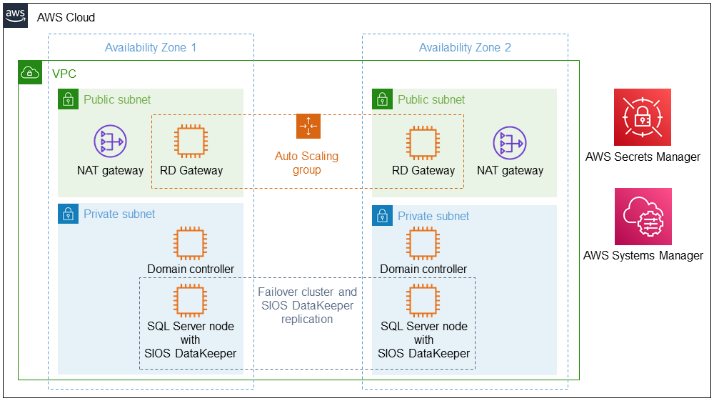

:xrefstyle: short

Deploying this Quick Start for a new virtual private cloud (VPC) with
default parameters builds the following {partner-product-short-name} environment in the
AWS Cloud.

// Replace this example diagram with your own. Follow our wiki guidelines: https://w.amazon.com/bin/view/AWS_Quick_Starts/Process_for_PSAs/#HPrepareyourarchitecturediagram. Upload your source PowerPoint file to the GitHub {deployment name}/docs/images/ directory in this repo. 

[#architecture1]
.Quick Start architecture for {partner-product-short-name} on AWS

As shown in <<architecture1>>, the Quick Start sets up the following:

* A highly available architecture that spans two Availability Zones.*
* A VPC configured with public and private subnets, according to AWS
best practices, to provide you with your own virtual network on AWS.*
* In the public subnets:
** Managed network address translation (NAT) gateways to allow outbound
internet access for resources in the private subnets.*
** Remote Desktop Gateway instances in an Amazon Elastic Compute Cloud (Amazon EC2) Auto Scaling group for remote administration.*
* In the private subnets:
** Two Active Directory domain controllers.
** Two Microsoft SQL Server cluster nodes featuring SIOS DataKeeper replication software.
** AWS Secrets Manager to store credentials.
** An AWS Systems Manager runbook to automate the deployment.

[.small]#* The template that deploys the Quick Start into an existing VPC skips the components marked by asterisks and prompts you for your existing VPC configuration.#

Technical specifications for the architecture:

|===
|Component |Details

// Space needed to maintain table headers
|VPC |One AWS Region with two Availability Zones.
|Instance type |Minimum recommended instance type: m3.xlarge.
|Operating system |See http://docs.us.sios.com/WindowsSPS/8.5/LK4Wsrc/Output/DKCE/Output/DeployingDKCEinAWSQuickStart/Content/DataKeeper/DKCE_Support_Matrix.htm[DKCE Support Matrix].
|Elastic IP |An Elastic IP address connected to the RD Gateway server.
|Instances |Four instances: Two DNS / Active Directory domain controllers and two SIOS DataKeeper / SQL Server cluster nodes.
|SQL Server |Elastic network interface (ENI) with three IPs for each SQL Server instance.
|Volumes |Two volumes, Amazon Elastic Block Storage (Amazon EBS) and NTFS only: One primary volume (C drive) and one volume for replicated data storage.
|===
